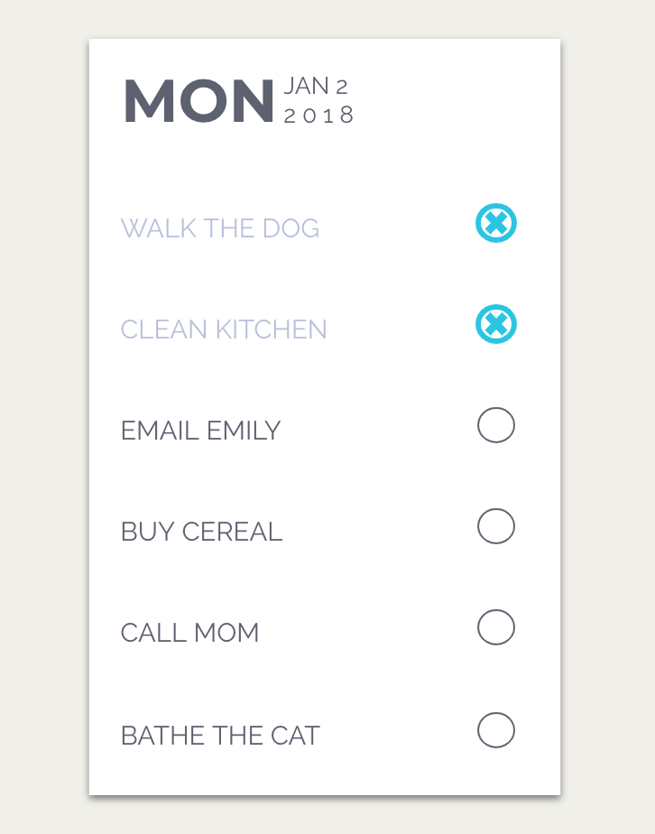

# A todo application with socketio

Create a realtime todo list application using Socket.io and Mongo as the database.

Use this image as the UI guide.

When adding or deleting a todo entry it should automatically appear or disapear in every window or tab in which the todo list application is open.

The application must be deployed to Heroku with Mongo. 